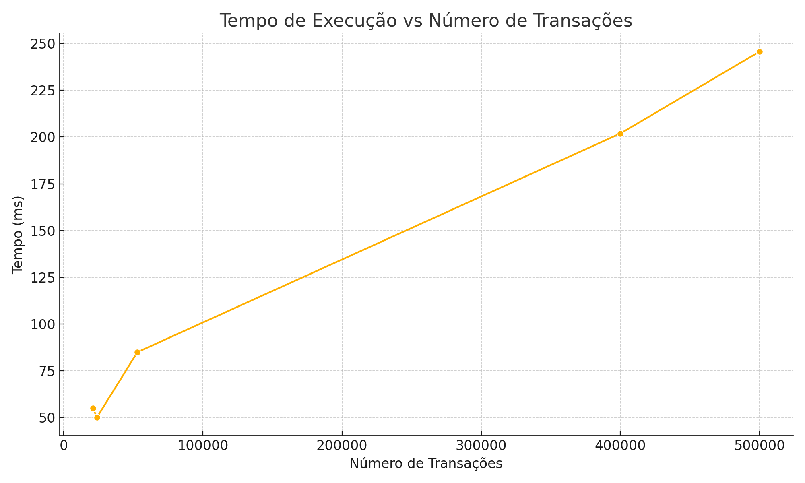
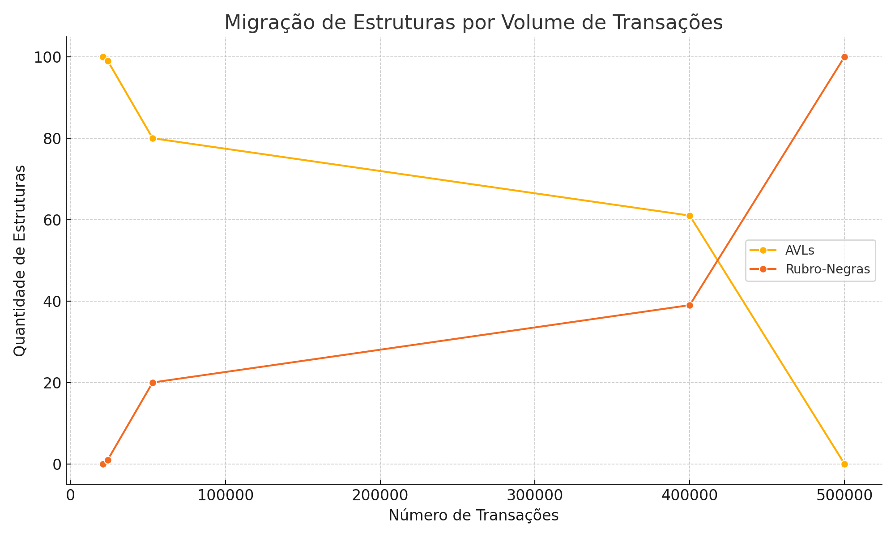

# Relatório de Execução - Tabela Hash Híbrida com AVL e Rubro-Negra

## Objetivo
Avaliar o desempenho da implementação de uma tabela hash híbrida que realiza:
- Encadeamento por ID (listas ligadas)
- Sondagem quadrática por origem com migração para árvore AVL após 3 colisões
- Conversão da AVL para árvore Rubro-Negra caso ultrapasse altura 10

## Resultados dos Testes

| Transações | Comparações | Atribuições | Tempo (ms) | AVLs | Rubro-Negras |
|------------|--------------|--------------|-------------|------|----------------|
| 21000.0 | 405511.0 | 550265.0 | 54.957 | 100.0 | 0.0 |
| 24000.0 | 471610.0 | 638320.0 | 50.177 | 99.0 | 1.0 |
| 400000.0 | 3043984.0 | 4981146.0 | 201.895 | 61.0 | 39.0 |
| 500000.0 | 3455807.0 | 5862907.0 | 245.685 | 0.0 | 100.0 |
| 53000.0 | 684434.0 | 1007568.0 | 84.990 | 80.0 | 20.0 |

## Análise

- Em volumes menores (21k–24k), praticamente não há migração para Rubro-Negras.
- A partir de 50k transações, surgem múltiplas AVLs e algumas migram para RBs.
- Com 400k ou mais, a maior parte das AVLs é convertida em RBs, estabilizando o sistema.
- O tempo de execução permanece eficiente mesmo com 500 mil transações.

## Gráficos

